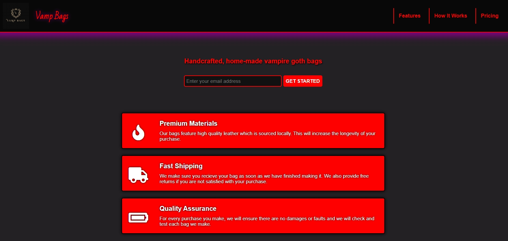

# 👜 Blackkat | Product Landing Page Vamp Bags

## 📖 Overview
This product landing page was created as part of my Responsive Web Design certification through FreeCodeCamp. The objective of the project was to build a responsive product layout with form handling using only HTML and CSS. I chose to create Vamp Bags, a fictional gothic, fantasy inspired brand, to explore dark aesthetics and give the project a unique personal style.

The page features a demo product lineup, a features section, an embedded video, responsive navigation, and an email signup form used for demonstation purposes. While the email form and footer links are not connected to a backend, they simulate real world functionality and layout behavior within a front-end only project.

## ✨ Features
- Fixed top navigation bar that remains visible while scrolling.
- Logo and navigation links inside the header.
- Email sign-up form with HTML5 email validation.
- Product showcase with Features, Video, and Pricing sections.
- Embedded YouTube video in “How It Works.”
- Responsive layout with CSS Flexbox and a media query.
- Styled buttons, hover effects, and consistent gothic/fantasy design theme.
- Footer with developer credit and external link.

## 🛠️ Built With
- HTML – structure
- CSS – styling

## 🧰 Skills Demonstrated
- Semantic HTML structuring
- Responsive design with CSS (flexbox + media query)
- Fixed-position top navigation
- Form creation with input validation
- CSS theming and hover effects
- Used hover states and customized the design with gothic/fantasy-inspired styling.

## 🚀 How to Use
[`View Live Project`](https://blackkat-dev.github.io/blackkat-product-landing-page/)

1. Use the top navigation to move between sections.
2. Enter your email and click Get Started to test the form submission.
3. Check out the Features, How It Works video, and Pricing product options.
4. Resize the browser window to see responsive adjustments.
5. Click **Blackkat** in the footer to view more about the developer on Linktree.

## 📂 Project Structure
vamp-bags-product-landing-page/ `root folder`

│── index.html `main webpage`  

│── css/ `styling folder`

│   └── styles.css `styling` 

│── img/ `image folder`

│   └── vamp-bags-logo.png `logo image`

│   └── website-favicon.svg `favicon`

│   └── website-preview.png `preview image`

│── LICENSE `license details` 

│── README.md `project details` 

## 📌 Learning Goals
- Built a multi-section product landing page with semantic structure.
- Implemented a fixed-position top navbar with logo and links.
- Created a working email form with validation for user submissions.
- Embedded a YouTube video with the correct id="video".
- Styled products with flexbox layout and responsive design.

## 🎯 Certification Compliance
This project fully meets all FreeCodeCamp Responsive Web Design
Product Landing Page user stories and requirements.

## 📸 Preview

[`View Live Project`](https://blackkat-dev.github.io/blackkat-product-landing-page/)

## 📄 License 
This project is provided for portfolio and educational review only. 
Copying, redistribution, or commercial use is prohibited. 

This project is licensed under a Blackkat Proprietary License. 
See the [LICENSE](https://github.com/blackkat-dev/blackkat-product-landing-page/blob/main/LICENSE) file for full terms.
